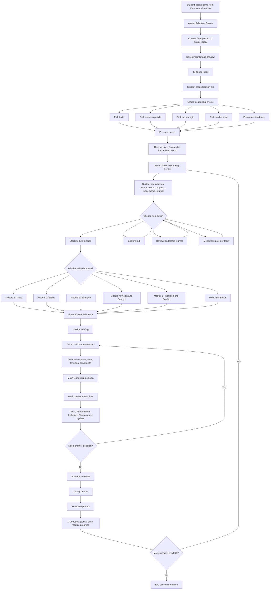
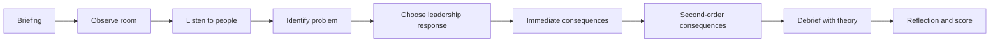
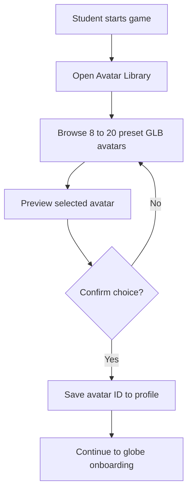
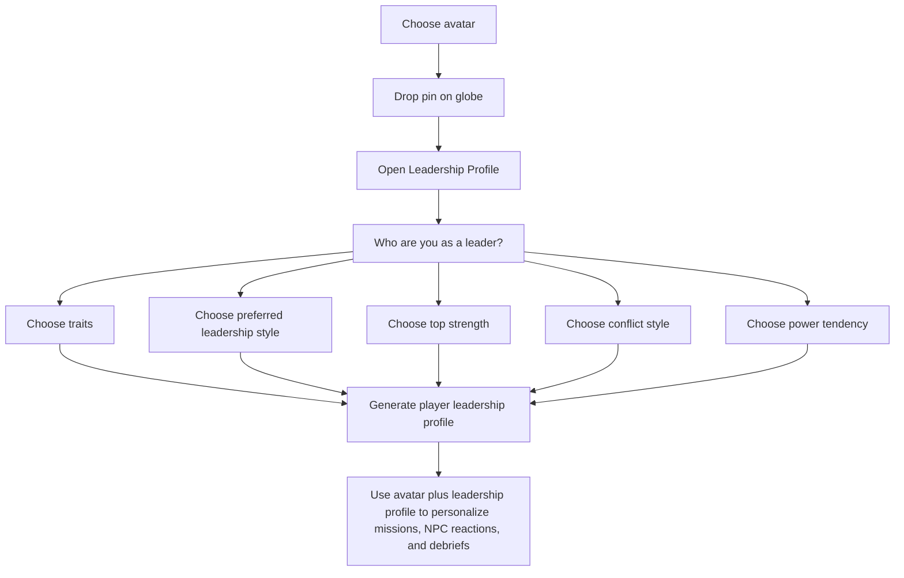
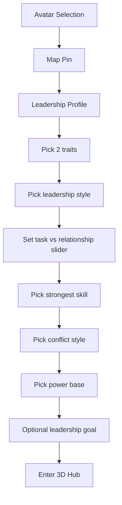
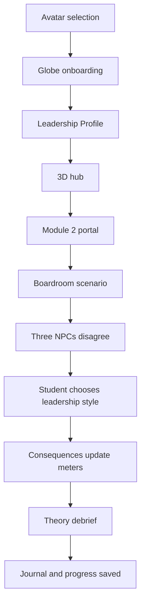

# OGL 200 3D Leadership Game Flow

This document shows the recommended game flow for an immersive 3D version of the OGL 200 experience.

Students begin by choosing an avatar from a small library of preset 3D characters.

## Core Idea

The globe is the geographic entry point.

The first onboarding step is avatar selection.

The actual game happens in a 3D leadership world where students enter module-based scenario rooms, make leadership decisions, and receive theory-based feedback.

## Full Game Flow

## Single Mission Loop

## 3D World Structure

```mermaid
flowchart TD
    A[3D Hub: Global Leadership Center] --> B[Portal 1: Hall of Traits]
    A --> C[Portal 2: Boardroom of Styles]
    A --> D[Portal 3: Team Operations Floor]
    A --> E[Portal 4: Vision Dome]
    A --> F[Portal 5: Inclusion Commons]
    A --> G[Portal 6: Ethics Tribunal]

    B --> B1[Recognize leadership vs management]
    B --> B2[Identify traits]
    B --> B3[Spot destructive leadership]

    C --> C1[Compare authoritarian, democratic, laissez-faire]
    C --> C2[Balance task vs relationship]

    D --> D1[Use strengths]
    D --> D2[Practice team leadership]

    E --> E1[Create vision]
    E --> E2[Lead groups]
    E --> E3[Handle Tuckman stages]
    E --> E4[Work with out-group members]

    F --> F1[Embrace diversity]
    F --> F2[Manage conflict]
    F --> F3[Collaborate through disagreement]

    G --> G1[Ethical leadership]
    G --> G2[5 bases of power]
    G --> G3[6 pillars of character]
    G --> G4[Toxic triangle]
```

## What Happens Right After Map Pinning

The student should not stay on the globe for long.

Before pinning their location:

1. The student chooses an avatar from a small preset 3D character library.
2. The system saves the selected avatar for all future scenes.

After pinning their location:

1. The system creates their identity in the cohort.
2. The student completes a Leadership Profile.
3. The globe becomes a transition animation.
4. The player enters the 3D hub world using the chosen avatar.
5. The first unlocked mission starts.

This means the map is the social and visual entry layer, while the 3D world is the real gameplay layer.

## Avatar Selection Flow

The avatar library should be small, curated, and web-optimized.

The goal is not infinite customization. The goal is a stable, fast onboarding flow.

## Leadership Profile Flow

## Exact Leadership Profile Fields

Keep the first-run profile short.

Target completion time: `2 to 3 minutes`.

### Required Fields

| Field | Prompt shown to student | Type | Options |
|---|---|---|---|
| `top_traits` | Which 2 leadership traits do you most want to lead with? | Multi-select, choose 2 | Drive, Motivation, Cognitive Ability, Confidence, Integrity, Knowledge |
| `preferred_style` | When you are in charge, which leadership style do you naturally default to? | Single-select | Authoritarian, Democratic, Laissez-faire |
| `task_relationship_balance` | Under pressure, what do you prioritize first? | 5-point slider | 1 = Task First, 3 = Balanced, 5 = Relationship First |
| `strongest_skill` | Which skill currently feels strongest for you? | Single-select | Communication, Organizing, Problem Solving, Relationship Building, Strategic Thinking, Follow-through |
| `conflict_style` | When conflict appears, what is your usual first move? | Single-select | Collaborating, Competing, Avoiding, Accommodating, Compromising |
| `power_base` | Which source of influence are you most likely to use first? | Single-select | Legitimate, Reward, Expert, Referent, Coercive |

### Optional Field

| Field | Prompt shown to student | Type | Suggested limit |
|---|---|---|---|
| `leadership_goal` | What kind of leader do you want to become by the end of this course? | Short text | 120 characters |

## Why These Fields Matter

| Field | Why the game needs it |
|---|---|
| `top_traits` | Personalizes Module 1 feedback and helps compare self-image with actual choices |
| `preferred_style` | Drives Module 2 scenarios and lets the game challenge default habits |
| `task_relationship_balance` | Shapes how NPCs react when the player chooses speed versus trust |
| `strongest_skill` | Feeds Module 3 role assignments and team-based missions |
| `conflict_style` | Personalizes Module 5 conflict scenes and debriefs |
| `power_base` | Feeds Module 6 ethics, power, and destructive leadership scenarios |
| `leadership_goal` | Makes reflection and end-of-module debriefs feel personal |

## What Not To Ask In Onboarding

Do not overload the student on day one.

Avoid asking for:

- long essays
- full personality tests
- all six pillars of character
- detailed diversity or ethics questionnaires
- multiple text reflections before play begins

Those should appear later inside missions, not inside onboarding.

## Recommended UI Order

## How The Profile Should Be Used In Gameplay

- show the selected traits and style on the player card in the hub
- use `preferred_style` and `conflict_style` to generate scenario tension
- use `strongest_skill` to assign special team roles
- compare player choices against their own stated profile during debrief
- surface growth over time by showing: `You said you value Integrity, but in this mission you chose speed over fairness`

## Scenario Logic

Every mission should use the same four visible meters:

- Trust
- Performance
- Inclusion
- Ethics

Each decision should shift one or more of these meters.

That gives students a visible way to understand leadership tradeoffs.

## Recommended First Playable Slice

Build one complete module before trying to build the whole world.

Recommended first slice:

Module 2 is a strong first slice because leadership styles, decisions, and tradeoffs are easy to make visible in a 3D room.
