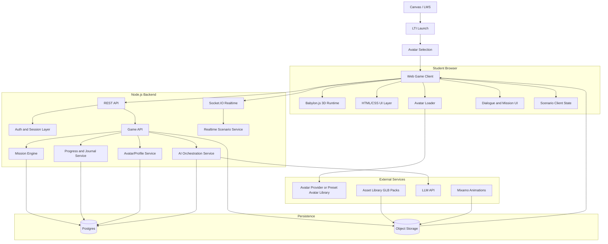
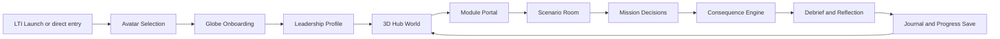
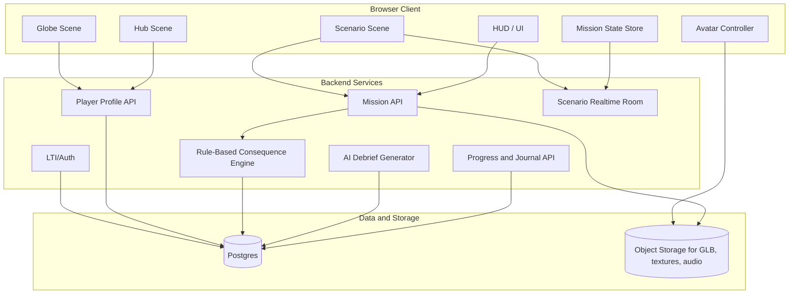
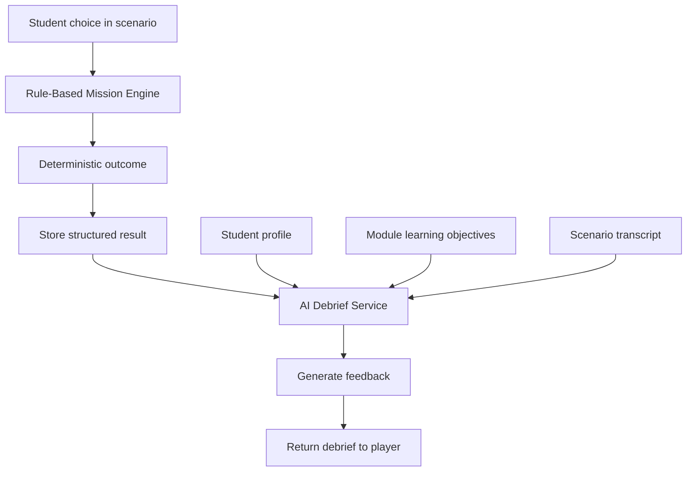
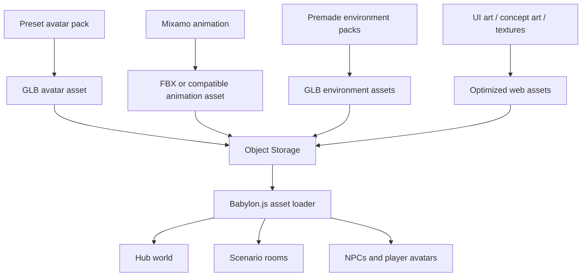
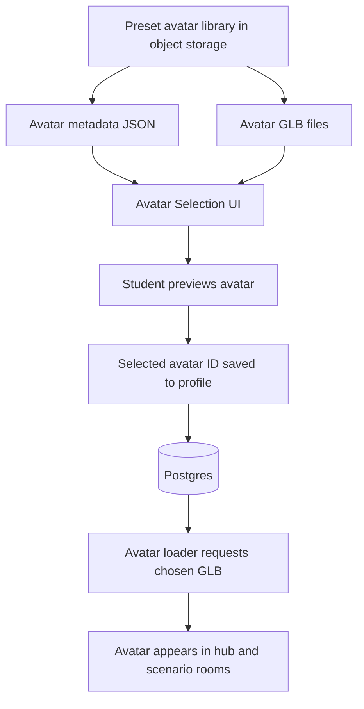
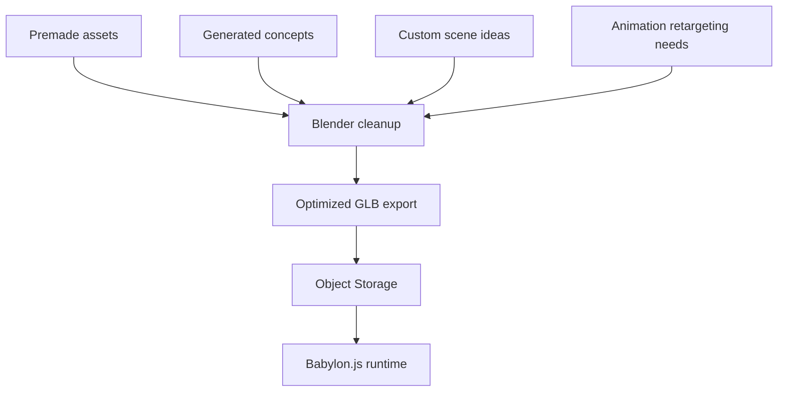
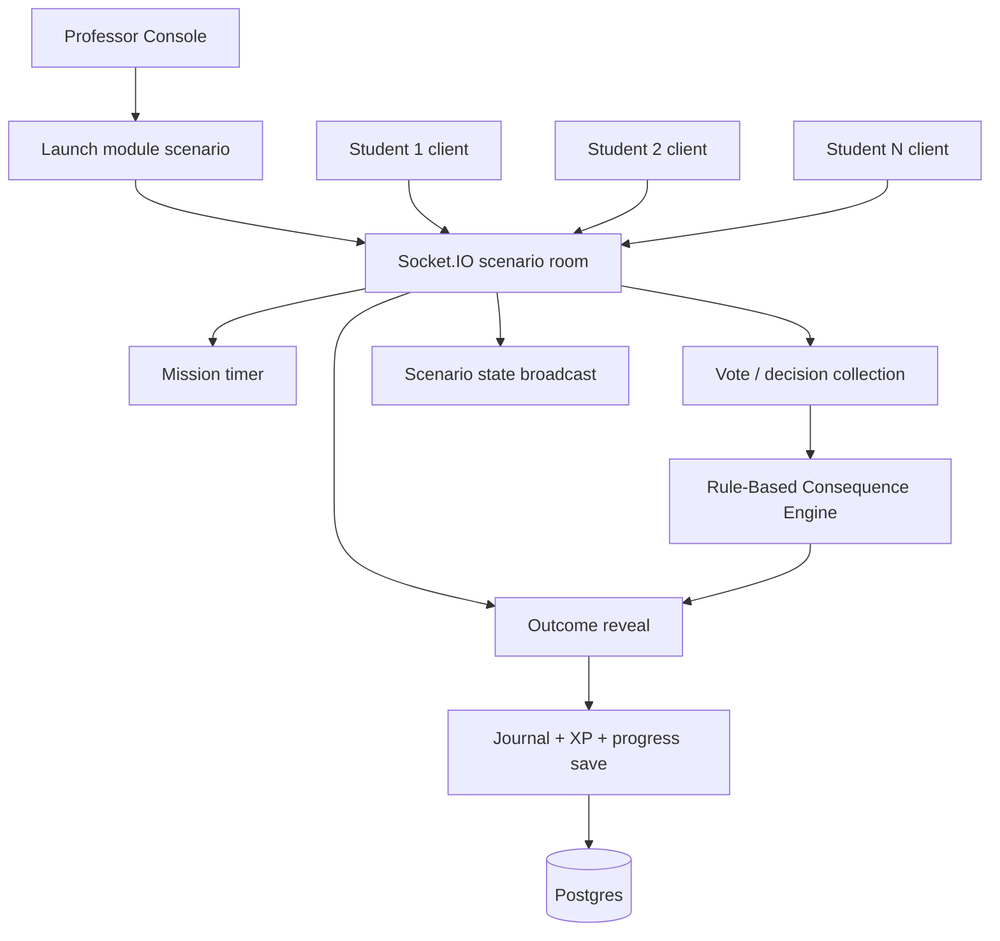
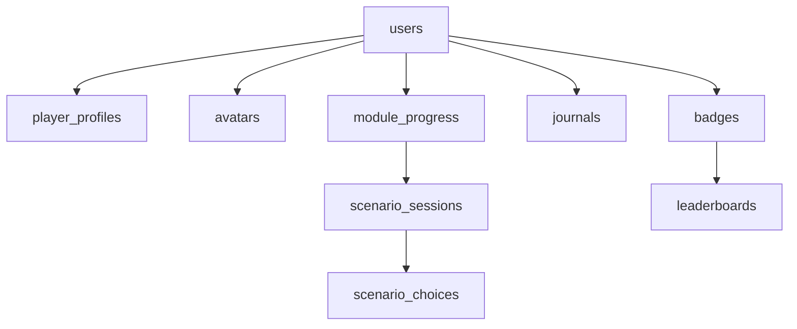
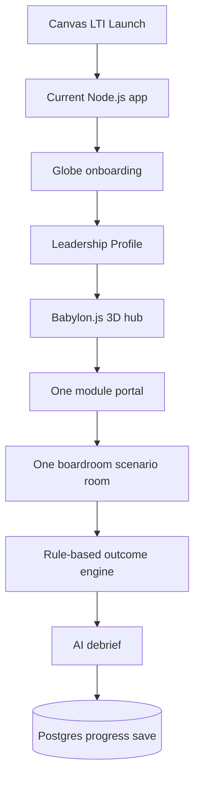

# OGL 200 3D Game Architecture Diagram

This document turns the recommended OGL 200 game stack into a concrete implementation architecture.

## Recommended Stack

- 3D client: `Babylon.js + TypeScript`
- App/backend: `Node.js + Express or Fastify`
- Realtime sync: `Socket.IO`
- LMS integration: `LTI 1.3`
- Database: `Postgres`
- Object storage: `S3 / Cloudflare R2 / equivalent`
- Avatars: `Managed avatar provider or preset GLB avatars`
- Character animations: `Mixamo`
- AI: `Claude or OpenAI`
- Asset format: `.glb / glTF`
- Optional later: `Blender` for asset editing and custom world building

## Avatar Strategy

Use a small preset avatar library for the MVP.

- prepare `8 to 20` web-optimized humanoid `.glb` avatars
- let students choose one during first-run onboarding
- store `avatar_id` in the user profile
- load that avatar in the hub, classroom scenes, and scenario rooms

This is simpler and more stable than relying on a live avatar SaaS.

## High-Level System Architecture

## Runtime Game Flow Architecture

## Detailed Client-Server Architecture

## AI Integration Architecture

Use AI for dialogue, debriefs, and personalization.

Do not make AI the primary source of game truth in the MVP.

## Asset Pipeline Without Blender First

This is the recommended MVP path.

## Preset Avatar Selection Architecture

## Asset Pipeline With Blender Later

Use this after gameplay is proven.

## Multiplayer and Classroom Session Architecture

## Data Model Overview

## Concrete Implementation Layers

### Layer 1: LMS Entry

- Canvas launches the game using `LTI 1.3`
- User identity is established before entering the 3D world

### Layer 2: Browser Game Client

- Avatar selection scene
- Globe onboarding scene
- Leadership Profile form
- 3D hub world
- Module scenario rooms
- HUD, dialogue, mission overlays

### Layer 3: Game Backend

- Player profile and module unlocks
- Scenario selection
- Real-time classroom sync
- Rule-based scoring and consequence logic
- Journal and reflection persistence

### Layer 4: AI Services

- NPC text generation
- Personalized debriefs
- Reflection summaries
- Instructor insight generation

### Layer 5: Asset Delivery

- Avatar GLBs
- Environment GLBs
- Animations
- Audio and textures

## Recommended MVP Architecture

Build this first:

This MVP does not require Blender.

## Practical Recommendation

Use two phases:

### Phase 1: No-Blender MVP

- Babylon.js
- preset GLB avatars
- Mixamo
- Premade GLB environment assets
- Node.js backend
- Postgres
- Socket.IO

### Phase 2: Custom World Pipeline

- Add Blender
- Clean and optimize assets
- Build a more distinctive hub and module rooms
- Create a stronger visual identity for the course

## Final Recommendation

For this project:

- Use a browser-first engine/runtime, not Unreal
- Use diffusion only for concept art and non-rigged visual assets
- Use Babylon.js for the 3D runtime
- Use preset GLB avatars for the MVP avatar picker
- Use Mixamo for animations
- Delay Blender until the gameplay loop is working
