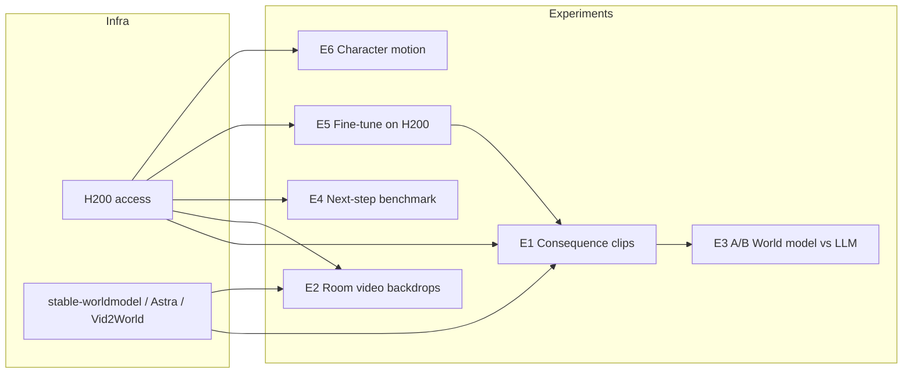

# World Model Experiments for Student-World (H200, March 2026)

## 1. How Your Plans Use “World Model”

In your docs, **“World Model”** means the **AI orchestration layer** (Claude) that holds state and reasoning—not video/simulation models:

| Plan                                                                                  | “World Model” role                                                                  | Key outputs                                           |
| ------------------------------------------------------------------------------------- | ----------------------------------------------------------------------------------- | ----------------------------------------------------- |
| **A** ([plan-A-ai-globe-characters.md](docs/plans/plan-A-ai-globe-characters.md))     | Stateful brain: 195 country personas, student history, class state, connection arcs | Streaming character chat, voice, journal              |
| **B** ([plan-B-live-class-ai-theater.md](docs/plans/plan-B-live-class-ai-theater.md)) | Scenario engine: roles, collective decisions, consequence simulation, debrief       | Live outcome narrative, decision arcs, theory mapping |
| **C** ([plan-C-immersive-sim-rooms.md](docs/plans/plan-C-immersive-sim-rooms.md))     | Full sim runtime: room generation, multi-character orchestration, rubric evaluation | 3D rooms, scorecards, leadership stories              |

So the **experiments** below add **ML world models** (video/simulation) on top of this—using your H200 to run or train them and optionally plug results into the same flows.

---

## 2. Latest World Models (March 2026) — Relevant to H200

From recent papers and releases (ICLR 2026, arXiv 2025–2026):

- **Astra** — General interactive world model; autoregressive denoising; long-horizon video; action-conditioned (driving, robot, camera). Code: [EternalEvan/Astra](https://github.com/EternalEvan/Astra); checkpoints + inference available; good fit for H200 inference/batch.
- **WoW (World-Omniscient)** — 1.3B and 14B on Hugging Face; robot interaction trajectories; forward/inverse control, video + action; SOPHIA-guided. H200 can run 14B comfortably.
- **Vid2World** — Video diffusion → interactive world model; action-conditioned; domains: RT-1, CSGO, RECON. ICLR 2026; checkpoints on HF. Suited for controlled “what happens next” rollouts.
- **DreamDojo (NVIDIA)** — Generalist robot world model; 44k hours egocentric; code on GitHub. Strong candidate for H200 (NVIDIA stack).
- **World-VLA-Loop** — Closed-loop video world model + VLA policy; failure rollouts improve model. Research code; useful for “improve from student-world data” experiments.
- **EVA / Reflection** — Embodied video prediction; EVA-Bench for evaluation. Good for benchmarking “what happens next” in embodied settings.
- **stable-worldmodel (SWM)** — Modular research stack: data collection, planning, baselines. Useful as infra for your own data and training on H200.
- **Hybrids (WebWorld, SimWorld, R-WoM)** — LLM + world model / code “physics”; narrative + structured state. Conceptually close to Plan B (scenario state + consequences).
- **Yume** (Shanghai AI Lab) — Interactive world generation from image, text, or video. Yume 1.0 (Jul 2025): image → keyboard-controlled explorable world, MVDT + memory for infinite video. Yume 1.5 (Dec 2025): text-controlled generation, bidirectional attention distillation, text prompts for random world events. Yume-5B (Dec 2025): 5B params, 720P; I2V 540P. Apache 2.0; [GitHub stdstu12/YUME](https://github.com/stdstu12/YUME), [HF Yume-5B-720P](https://huggingface.co/stdstu123/Yume-5B-720P), [Yume-I2V-540P](https://huggingface.co/stdstu123/Yume-I2V-540P). Strong fit for E1/E2 (consequence clips, room backdrops) and E4; “interactive world” aligns with Plan C sim rooms.

**H200 relevance**: 141GB HBM3e, 4.8 TB/s bandwidth; ideal for large-model inference (e.g. WoW-14B, long-context Astra), batched video rollouts, and training/adaptation of world models or adapters.

---

## 2b. Chinese open-source models (Jan 2025 – Mar 2026)

Many strong open-source models from Chinese labs were released in this window. Below are the ones that are **released by the orgs**, **open-sourced** (weights/code), and relevant to world-model / video / orchestration experiments on H200.

### Video and “world-model-style”

| Model | Org | Released | Open source | Relevance to experiments |
|-------|-----|----------|-------------|---------------------------|
| **Wanxiang 2.1 (Wan 2.1)** | Alibaba (Tongyi Lab) | Feb 2025 | Yes (Apache 2.0); GitHub, HF, ModelScope | **E1, E2**: T2V/I2V; 1.3B (8.2GB VRAM) and 14B; 480P/720P; Chinese+English text-in-video; VBench 86.22%. H200 can run 14B and batch 1.3B. [Wan-AI/Wan2.1-T2V-1.3B](https://huggingface.co/Wan-AI/Wan2.1-T2V-1.3B), [wan-video/wan2.1](https://github.com/wan-video/wan2.1). |
| **VideoWorld** | ByteDance (Doubao) + BJTU + USTC | Feb 2025 | Yes; open-sourced | **E4, E5**: “Pure visual” world model (no LLM); 300M params; latent dynamic model; Go 5-dan, robot tasks, 37-step origami; 78%+ manipulation success. Good for “what happens next” / embodied-style benchmarks. [Paper 2501.09781](https://huggingface.co/papers/2501.09781). |
| **Yume / Yume 1.5 / Yume-5B** | Shanghai AI Lab | Jul 2025 (1.0), Dec 2025 (1.5, 5B) | Yes (Apache 2.0); GitHub, HF | **E1, E2, E4**: Interactive world generation from image/text/video; text-controlled “world events”; 5B @ 720P, I2V 540P; MVDT + memory, infinite rollouts. Same org as Intern-S1-Pro. [stdstu12/YUME](https://github.com/stdstu12/YUME), [Yume-5B-720P](https://huggingface.co/stdstu123/Yume-5B-720P), [Yume-I2V-540P](https://huggingface.co/stdstu123/Yume-I2V-540P). |

### LLMs (orchestration, long context, reasoning)

| Model | Org | Released | Open source | Relevance to experiments |
|-------|-----|----------|-------------|---------------------------|
| **Qwen3.5** | Alibaba | Feb 2026 | Yes | 397B MoE, 17B active; 262K→1M context; vision-language; 201 languages. Smaller 0.8B–122B. Alternative “brain” for Plan A/B/C or judge for E1–E4. [QwenLM/Qwen3.5](https://github.com/QwenLM/Qwen3.5). |
| **Qwen3-Next-80B-A3B** | Alibaba | Sep 2025 | Yes | Ultra-sparse MoE; long context. Same use as above. |
| **Qwen3-VL** | Alibaba | 2025–2026 | Yes | 2B–32B; visual agent, 256K→1M context, video understanding, OCR. For multimodal “next step” or room/backdrop conditioning. [QwenLM/Qwen3-VL](https://github.com/QwenLM/Qwen3-VL). |
| **MiniMax-M1** | MiniMax | Jun 2025 | Yes (MIT/Apache 2.0) | 1M context, 80K reasoning; SWE-bench ~55–56%. Plan B/C orchestration or reasoning baseline. [MiniMaxAI/MiniMax-M1-40k](https://huggingface.co/MiniMaxAI/MiniMax-M1-40k). |
| **MiniMax-M2.1** | MiniMax | Dec 2025 | Open-weight | 230B, 10B active; 205K context. Same as above. |
| **DeepSeek R1 Distill Qwen 32B** | DeepSeek | Jan 2025 | Yes (Apache 2.0) | 128K context; reasoning distillate. Lightweight orchestration or judge. |
| **TeleChat3-105B / 36B** | China Telecom | Dec 2025 | Open-sourced | 105B MoE (4.7B active) and 36B dense; “Thinking” mode; SWE 51, Tau2 63.6. Trained on domestic HW. Alternative for scenario/debrief generation. |
| **Intern-S1-Pro** | Shanghai AI Lab | Feb 2026 | Yes | 1T MoE, 22B active; scientific/agent; SAGE arch. For heavy reasoning or agent-style experiments. [Shanghai AI Lab blog](https://shanghaiopen.org.cn/en/blog/2026/02/05/). |
| **GLM-4.5V / GLM-4.1V-9B-Thinking** | Zhipu AI | 2025–2026 | Yes | 106B MoE (12B active), 66K context; 4.1V-9B “thinking”; video understanding, STEM. Multimodal judge or “next step” for E4. |

### Other (code, image, infra)

| Model | Org | Released | Open source | Note |
|-------|-----|----------|-------------|------|
| **KAT-Dev-72B-Exp / 32B** | Kuaishou (Kwaipilot) | 2025 | Yes (Apache 2.0) | Code model; SWE-bench leader. For any code-gen in pipelines. |
| **USO** | ByteDance | Aug 2025 | Yes | Style/subject-driven image generation; ComfyUI, fp8. Could complement room backdrops (E2) if you want static art. [bytedance/USO](https://github.com/bytedance/USO). |
| **OpenOneRec** | Kuaishou | 2025–2026 | Yes | 1.7B/8B on Qwen3; recommendation + LLM. Less direct for world models but useful if you add recommendation/engagement logic. [Kuaishou-OneRec/OpenOneRec](https://github.com/Kuaishou-OneRec/OpenOneRec). |

### Where to plug Chinese models into your experiments

- **E1 (consequence clips), E2 (room video)**: Prefer **Wanxiang 2.1** for T2V/I2V on H200 (1.3B for fast iteration, 14B for quality); supports Chinese prompts. **Yume** (Shanghai AI Lab) is a strong alternative: text-controlled world events, I2V, 5B @ 720P; good for “what happens in this room/crisis” rollouts.
- **E4 (next-step benchmark)**: Add **VideoWorld** as a pure-visual baseline; add **Yume** for interactive-world “next step”; add **Qwen3-VL** or **GLM-4.5V** as multimodal “next step” or judge.
- **Orchestration / judge (E1–E4)**: **Qwen3.5**, **MiniMax-M1/M2.1**, **TeleChat3**, or **GLM-4.x** as alternative or supplement to Claude for scenario text, debrief, or alignment scoring.
- **E5 (fine-tune)**: If you curate Chinese-language scenario data, Wanxiang, VideoWorld, or **Yume** checkpoints are viable base models for adaptation on H200.

---

## 3. Proposed Experiments (H200 + Latest World Models)

Each experiment is scoped to: **hypothesis**, **world model(s)**, **H200 use**, **data**, **success metrics**, and **link to Plan A/B/C**.

---

### Experiment 1: Consequence clips for Live Theater (Plan B)

- **Idea**: After the class makes a collective decision in Plan B, add a **short (5–15 s) action-conditioned video** of “what happens” (e.g. crisis zone calming vs escalating) instead of text-only outcome.
- **Models**: Astra, Vid2World, or **Yume** (Shanghai AI Lab; text-controlled world events, I2V; action = text prompt or outcome token).
- **H200**: Batch inference to generate 2–3 outcome variants per scenario; optionally precompute a library of outcome clips for fixed scenario types.
- **Data**: Scenario descriptions + outcome labels from Plan B (when available); otherwise hand-labeled “resolution” vs “escalation” for a few crisis types.
- **Metrics**: (1) Latency (target < 30 s from “reveal” to first frame); (2) Alignment with Claude narrative (human or LLM-as-judge); (3) Student survey: “felt real” / “helped me understand the consequence.”
- **Deliverable**: Small “consequence clip” pipeline: scenario outcome → action encoding → world model rollout on H200 → serve to front-end (e.g. overlay on globe or in theater UI).

---

### Experiment 2: Sim Room backdrops as video (Plan C)

- **Idea**: Replace or augment **static DALL-E/Stable Diffusion backdrops** in Plan C with **short procedural video** (e.g. camera pan across “Lagos community circle” or “Tokyo boardroom”) to increase immersion.
- **Models**: Astra (camera-motion control), WoW, or **Yume** (image/text → interactive world rollouts; 5B @ 720P, I2V 540P). DreamDojo if you want more “in-room” egocentric motion.
- **H200**: Inference to generate 10–30 s loops per room type; cache by (country, module) to avoid recomputation.
- **Data**: Text descriptions of room settings from your Plan C room generator; optional paired (description, short video) for a few rooms to fine-tune or select checkpoints.
- **Metrics**: (1) Cultural/contextual fit (human or Claude-as-judge); (2) Student engagement (time in room, optional survey); (3) Technical: no dropped frames at target resolution on playback.
- **Deliverable**: “Room video” API: `(country, module)` → precomputed or on-demand short video URL; integration point in [Plan C room generator](docs/plans/plan-C-immersive-sim-rooms.md) (e.g. `backdrop_prompt` → also trigger world-model video path).

---

### Experiment 3: World model vs LLM-only outcome (Plan B)

- **Idea**: A/B test: **(A)** current design (Claude-only consequence text + globe state) vs **(B)** same scenario with **Claude + world-model short video** (from Experiment 1). Test whether the world-model arm improves perceived realism and learning.
- **Models**: Same as Experiment 1 (Astra or Vid2World on H200).
- **H200**: Inference for arm B only; same batch/precompute strategy.
- **Data**: Same scenarios for both arms; post-session quiz (Northouse/concepts) and 2–3 survey questions (realism, understanding).
- **Metrics**: (1) Quiz delta (B vs A); (2) Survey “felt real” / “helped understand”; (3) Qualitative notes from instructor.
- **Deliverable**: Experiment log (arm, scenario, student id, quiz + survey), analysis script, 1–2 page summary. Informs product decision: “Do we ship consequence clips?”

---

### Experiment 4: “What happens next?” benchmark (Plans B & C)

- **Idea**: Borrow EVA-Bench style: **leadership-scenario “next step”** tasks. E.g. “Given this meeting state (text + optional 1–2 frames), what happens next?” with multiple-choice or open-ended. Run Astra, WoW, Vid2World (and optionally a text-only baseline) on H200.
- **Models**: Astra, WoW, Vid2World (+ optional DreamDojo); text baseline = Claude.
- **H200**: Centralized inference for all model runs; same machine for fair comparison.
- **Data**: Curate 50–100 “situation → next moment” items from Plan B/C scenarios (or synthetic); define action set / outcome labels.
- **Metrics**: Accuracy vs human or expert label; correlation with “narrative coherence” (LLM judge). Publish a small benchmark (e.g. “Student-World Next-Step”) for reproducibility.
- **Deliverable**: Dataset (train/val/test split), evaluation script, table of model results, short report. Positions student-world as a testbed for narrative/social world models.

---

### Experiment 5: Fine-tune or adapt a world model on H200 (Plans B/C)

- **Idea**: Use **stable-worldmodel** or Vid2World/Astra codebase to collect “student-world” trajectories (e.g. scenario state → decision → outcome state; optionally with synthetic or recorded “frames”). Fine-tune a small world model or an **adapter** (e.g. action embedding) so rollouts better match “leadership/crisis” semantics.
- **Models**: Vid2World or Astra as base; small adapter or low-rank fine-tune; data from Plan B logs (state, decision, outcome) once you have sessions.
- **H200**: Training job (single or multi-GPU); 1–3 day runs acceptable for a first iteration.
- **Data**: Logged (scenario_id, decisions[], outcome_summary, globe_state_delta); synthetic augmentation: “if decision was X, outcome would be Y” from Claude.
- **Metrics**: (1) Rollout quality (human or LLM judge: “Does this match the scenario?”); (2) Downstream: use fine-tuned model in Experiment 1 and compare to of-the-shelf.
- **Deliverable**: Trained checkpoint, training config, and a short “domain shift” report (base vs student-world adapted).

---

### Experiment 6: Embodied “character motion” for pins/avatars (Plan A / C)

- **Idea**: Use **WoW** or **DreamDojo** to generate **motion sequences** conditioned on “emotional state” or “leadership style” (mapped to a discrete or continuous action space). Use these as procedural animation for AI character avatars (e.g. on globe pins or inside Plan C rooms).
- **Models**: WoW (robot/humanoid motion) or DreamDojo; map “emotion”/“style” to action tokens or low-dim vector.
- **H200**: Batch inference to build a library of 20–50 short clips (e.g. “listening,” “challenging,” “agreeing”); serve as sprites or 3D clips in the client.
- **Data**: Define 5–10 “emotion/style” labels; generate 3–5 clips per label; optional human rating for “matches label.”
- **Metrics**: (1) Label consistency (human rating); (2) Integration: no performance regression in [client/globe.js](client/globe.js) or room renderer.
- **Deliverable**: Clip library + mapping (label → clip ids), integration in Plan A pin UI or Plan C character avatars.

---

## 4. Suggested order and dependencies

- **Start**: E1 (consequence clips) and E4 (benchmark) in parallel—E1 gives a clear Plan B feature; E4 gives a reusable benchmark and model comparison.
- **Next**: E3 (A/B) once E1 has a minimal pipeline; E2 (room video) when Plan C room generator is in progress.
- **Later**: E5 (fine-tune) when you have Plan B session logs or synthetic data; E6 (motion) when pin/avatar UI is ready.

---

## 5. Minimal tech notes for your repo

- **Stack**: Your app is Node/Express + Socket.io + Claude ([server/index.js](server/index.js), [server/insights.js](server/insights.js)). World model experiments will live **off the critical path**: separate Python services or scripts that call H200 (local or cloud), write outputs (video URLs or frames) to storage, and your Node server or client fetches them.
- **No code changes required for “plan mode”**: This plan only designs experiments; implementation (new repos, jobs, or endpoints) comes after you approve.

---

## 6. References (March 2026)

- Astra: [arXiv:2512.08931](https://arxiv.org/abs/2512.08931), [GitHub EternalEvan/Astra](https://github.com/EternalEvan/Astra).
- WoW: Hugging Face `WoW-world-model/WoW-1-Wan-14B-2M` and 1.3B variant.
- Vid2World: [thuml/Vid2World](https://github.com/thuml/Vid2World); ICLR 2026.
- DreamDojo: [nvidia/DreamDojo](https://huggingface.co/nvidia/DreamDojo).
- World-VLA-Loop: [arXiv:2602.06508](https://arxiv.org/abs/2602.06508).
- stable-worldmodel: [arXiv:2602.08968](https://arxiv.org/abs/2602.08968).
- EVA / Reflection: MLR 2025 “Empowering World Models with Reflection for Embodied Video Prediction”; EVA-Bench.
- H200: NVIDIA H200 (141GB HBM3e, 4.8 TB/s); suitable for inference and training of the above models.
- **Chinese open-source (Jan 2025–Mar 2026)**: Wanxiang 2.1 [Wan-AI/Wan2.1-T2V-1.3B](https://huggingface.co/Wan-AI/Wan2.1-T2V-1.3B), [wan-video/wan2.1](https://github.com/wan-video/wan2.1). VideoWorld [paper 2501.09781](https://huggingface.co/papers/2501.09781). **Yume** (Shanghai AI Lab) [arXiv:2507.17744](https://arxiv.org/html/2507.17744v1), [2512.22096](https://arxiv.org/html/2512.22096v1), [stdstu12/YUME](https://github.com/stdstu12/YUME), [Yume-5B-720P](https://huggingface.co/stdstu123/Yume-5B-720P). Qwen3.5 [QwenLM/Qwen3.5](https://github.com/QwenLM/Qwen3.5), Qwen3-VL. MiniMax-M1/M2.1 [MiniMaxAI](https://huggingface.co/MiniMaxAI/MiniMax-M1-40k). TeleChat3 (China Telecom). Intern-S1-Pro Shanghai AI Lab. GLM-4.5V / 4.1V (Zhipu). KAT-Dev (Kuaishou). USO [bytedance/USO](https://github.com/bytedance/USO).

